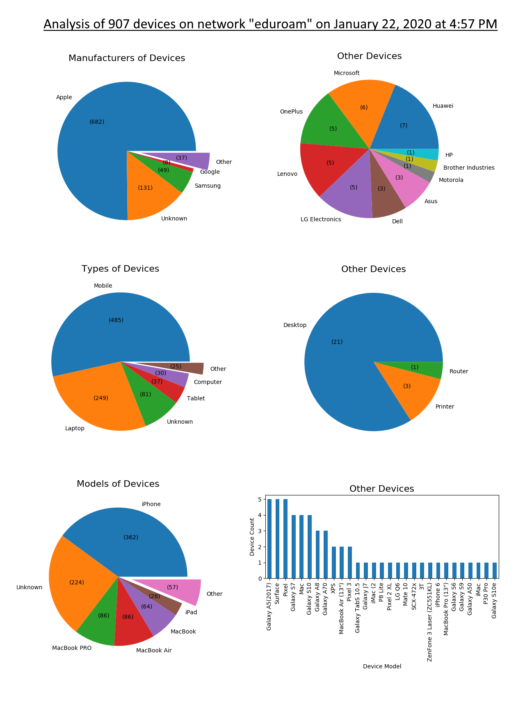

# NetworkAnalyze
Graph data from 'fing' network scanning app.

### Dependencies
- matplotlib
- pandas
### Usage
Scan a network with 'fing' app. Export data to .json format. Replace "data/data.json" in process.py with your filename.
Run process.py. Tweak graph params to make it look nice.

Combining the graphs in an image editor, you can produce something like this:

